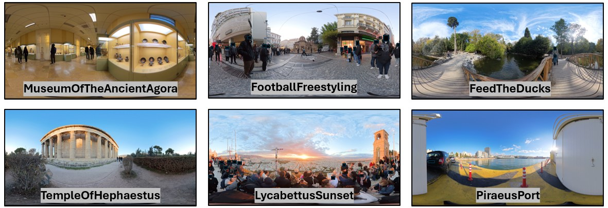
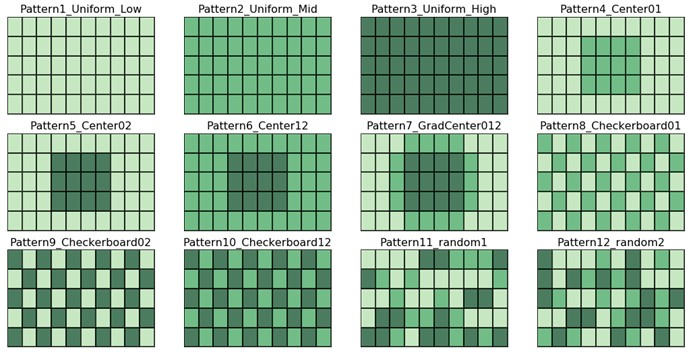

# STAV360
The Subjective Tile-based Assessment for 360° Videos (STAV360) Dataset provides 360° video sequences, head tracking data, and subjective ratings.

## File Organization
The dataset is organized as follows:
  - Reference Videos: Six reference sequences in ERP format. All video sequences are in 8K resolution @30fps, where each is 10s long. The videos were recorded using an Insta360 camera and converted to ERP format.
  - Video Tiles x265: Each of the references videos is divided into 10x5 tiles and each tile is encoded at six quality levels using ffmpeg’s x265 encoder (QP= 22,27,32,37,42,47).
  - Stitched Videos: Includes the stitched videos according to tiling setups described in the Tiling Patterns folder. The levels High, Mid, Low, correspond to QPs 42, 32, and 22, respectively.
  - Tiling Patterns: Contains the tiling patterns (in .json format) used for stitching the constructed videos. The files contain the pattern names and the tile qualities used in each pattern.
  - Head Tracking: Tracking data collected from users watching the stitched videos using a Meta Quest 3 VR headset.
  - Ratings: Ratings (1-5) of the stitched videos as reported by the users following the absolute category rating (ACR) method.
*note: more data will be added shortly.

  

## Patterns Description

Twelve tiling patterns were used in this work to account for different scenarios in tile-based 360° streaming and tile-based 360° video quality assessment (360° VQA). The detailed patterns can be viewed in the Tiling Patterns folder. Patterns 1-10 are the same for all videos. Whereas patterns 11 & 12 are random patterns that are different for each video. A visual representation of the tiling patterns is demonstrated below.

 

## Citation
If you use the STAV360 dataset in your research, please cite the GitHub repository.
(paper citation to be added)

## Contact
For any questions about the production of the dataset and data collection, please contact mmoatasim@singularlogic.eu

